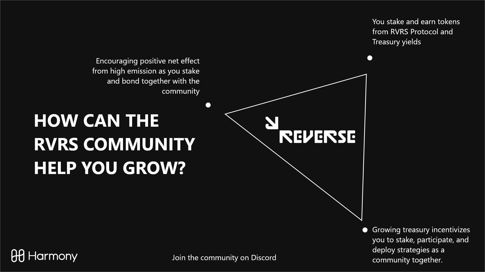
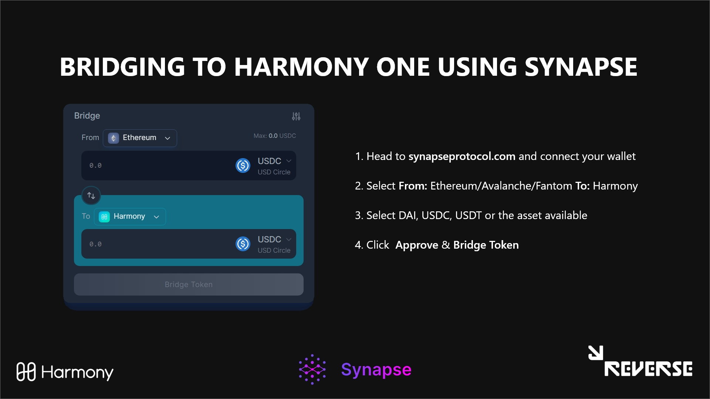
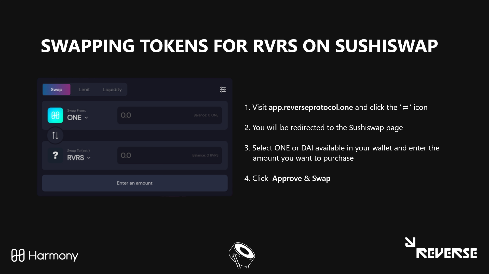

# 🤝 Bridge, Buy & Stake

## Overview of Bridging, Swapping and Staking RVRS

## How to bridge?

#### <mark style="color:orange;">Bridging Using Synapse</mark>&#x20;

1. [**Setting up Metamask**](https://medium.com/stakingbits/setting-up-metamask-for-harmony-one-4fe67c6d1026)
2. Connect your Metamask to [**Synapse Bridge**](https://synapseprotocol.com/?inputCurrency=USDC\&outputCurrency=USDC\&outputChain=1)****
3. Navigate to the "Bridge" tab in the Synapse app
4. Select the network that you wish to transfer funds out of using the "From" dropdown menu (if necessary, accept the request in your wallet to switch networks to that chain)
5. Select the assets that you wish to bridge from the dropdown menu to the right of the input field (stablecoins, ETH, or SYN, plus an expanding list of tokens from partnerships)
6. Select 'HarmonyONE' as destination chain from the "To" dropdown menu
7. Input the amount that you would like to transfer into the number field
8. Make sure that the amount you will be receiving appears correct, and click "Approve Token" to grant Synapse approval to spend the stablecoin you are swapping _(Note: you will receive the indicated amount of the native token when bridging to a non-Ethereum chain, enough to allow you to make 1-2 swaps upon arrival)_
9. Click "Bridge Token" after the approval has been confirmed to bridge your funds

#### <mark style="color:orange;">**Bridging using Horizon HarmonyOne**</mark>

1. Visit [**Harmony Horizon Bridge**](https://bridge.harmony.one)****
2. Depending on the chain you are bridging from, it is best recommended to use the [**Official Horizon Bridge Document**](https://docs.harmony.one/home/general/horizon-bridge)****

#### <mark style="color:orange;">Sending funds from an exchange</mark>

1. Copy your wallet address(0x..), and copy and paste it on [**Harmony Explorer**](https://explorer.harmony.one) and you will get your Harmony One wallet address starting with "one".
2. You can toggle between 'ONE' and '0x' address by using the Menu (3 dashes) on the top right corner of the screen.
3. Copy this 'ONE' address and save it, it will be your metamask wallet address.
4. Go to Binance or Kucoin, buy some ONE and withdraw it on your address and remember to select network as Harmony or ONE. On kucoin you can send a minimum of 20 ONE and on Binance you can send a minimum of 60 ONE.

## How to swap?

1. Once you have your ONES/DAI oo your Metamask, visit app.reverseprotocol.one and click the 'swap' icon and you will be redirected to app.sushi.com page with the 'RVRS' token selected by default.
2. Incase you do not see it; copy the contract address of REVERSE PROTOCOL (0xed0b4b0f0e2c17646682fc98ace09feb99af3ade) and PASTE it into import tokens on sushiswap. You will see RVRS. Import that token and buy from ONE/RVRS.
