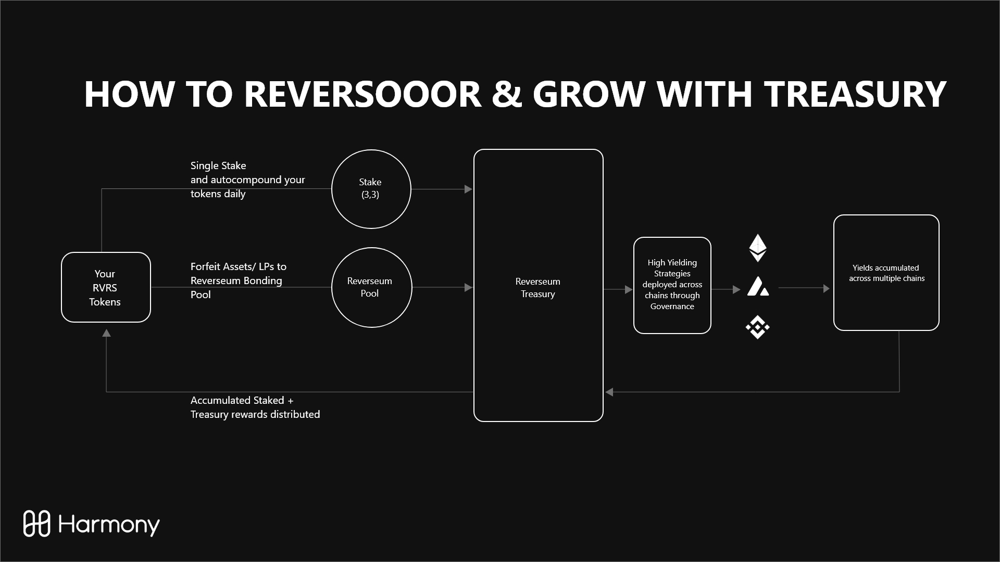

# 🏦 Reverseum Treasury

Liquidity and single assets are accumulated in the Reverseum Treasury through community pool auctions and bonding pools for the protocol's benefit and are governed by RVRS holders. Bonding pools are the main source of value for the Reverseum Treasury, as liquidity and single assets are stored in such.&#x20;

The treasury will never sell any of its RVRS. The Treasury's non RVRS assets are actively managed to maximize its efficiency and benefit the protocol's users through Snapshot Governance. This could for example entail the deployment of bonded UST on Terra's Mirror Protocol with delta-neutral strategies to maximize the Reverseum returns and expand its value, with the goal of, for example, supporting RVRS tokens or rewarding stakers with different assets such as DAI. RVRS holders and stakers can manage the Treasury and deploy a number of proposals such as:

* Use single assets to buy RVRS and distribute via RVRS staking
* Distribute assets such as DAI or ONE to protocol participants via RVRS staking
* Buy an asset using another asset in the treasury (e.g., buy RVRS with UST)
* Change the current strategy of assets to maximize their performance

### Community Pool Auctions

Reverse will regularly onboard smaller, Harmony-based projects, dubbed “community pools”, at a maximum of once every 3 weeks. These projects will be able to acquire a Reverse or Bonding pool on the Reverse Protocol by bidding ONE tokens, starting at 5,000 ONE. Of the funds raised, half will be used to buy RVRS from the market, and paired with the other half of ONE, and sent to the Reverseum treasury.
