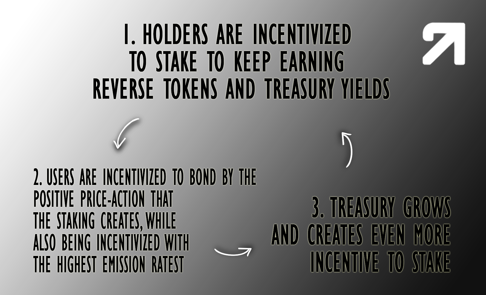

# 🪙 Staking

## <mark style="color:red;">Soon to be deprecated by veRVRS staking</mark>


The RVRS single staking is soon to be deprecated and will be replaced with the veRVRS staking contract


RVRS single-staking allows users to earn RVRS through auto-compounding yield, displayed as APY.

The endgame of the protocol and the way the protocol collaboration works best is that holders stake their tokens after bonding them, earning yield generated by the mutually agreed upon treasury strategies while contributing to price stability.&#x20;

Stakers will benefit from treasury yields in the form of stable assets, namely UST at the start.&#x20;

**This yield bearing strategy is the biggest difference between your common OHM Fork and reverse.**&#x20;

**While we are still burning half the bonded liquidity to produce a similar effect of the OHM Fork's token backing, we also allocate half the liquidity to a wide range of different yield generating strategies to then distribute to holders.**

**This strategy is intended to create more value out of bonded assets than just %100 of their value at the time.**

The endgoal of the protocol is to create a positive investment loop that incentivizes staking and bonding as the primary functions of the protocol.

