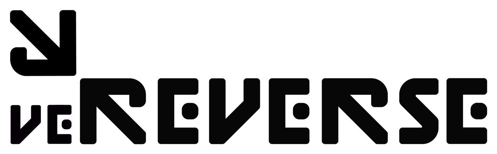

# 💰 veRVRS

Reverse Protocol's [refined staking implementation ](https://medium.com/@reverseprotocolONE/reverse-reinvents-rewarding-stakers-a2ef100c4519)encourages RVRS holders to stake their RVRS in exchange for rewards.

\
RVRS is staked in the veRVRS staking contract, which entitles stakers to a share of the UST airdrops, a share of the RVRS emissions and to the accumulation of veRVRS.\

## **UST Distributions**

RVRS protocol's staking is built upon a heavily refined (3,3) concept where staking entitles RVRS holders to weekly UST airdrops, allowing holders to make profit without ever selling the RVRS token.

The UST is sourced through deploying the Reverseum treasury in various yield bearing strategies controlled by community governance.\

**RVRS Emissions**\

RVRS stakers receive a share of all RVRS emissions. This rewards continuous supporters of the protocol with an increasing share of the growing treasury. RVRS emissions reduce over time, so this incentivises early adoption for taking on increased risk.\

## **veRVRS**

veRVRS acts as both the governance token for RVRS protocol and also as a [diamond hands style reward ](https://medium.com/@reverseprotocolONE/diamond-hands-through-vervrs-46dad3106d3)for RVRS stakers that boosts a staker's share of UST airdrops and RVRS emissions.

veRVRS is rewarded for staking and will build over time up to a cap – which is currently set at 4x the total RVRS staked. Any removal of RVRS from staking will immediately slash all of a users veRVRS balance. The time to hit cap is currently set at 3 months.


Any removal of RVRS from the veRVRS contract will slash all of a users veRVRS


veRVRS aligns the interests of long-term stakers with those of the protocol by offering a boost on rewards and acting as a user’s ticket to participate in protocol governance.

Currently 1/3 of total UST distributions and RVRS emissions are allocated based on veRVRS share. veRVRS can not be sent, bought or sold – the only way to get veRVRS is to diamond-hand RVRS in staking.\

## **RVRS Staking**

RVRS is encouraged to be staked long term in the contract through rewarding RVRS stakers – however RVRS is NEVER hard locked – RVRS can always be removed from the pool, however the loss of veRVRS creates an incentive to not do so.\

There is also a withdrawal fee, which is currently set at 5% for the first 2 weeks, which prevents short term actors from gaming the airdrops or governance.


There is a withdrawal fee of 5% for the first 2 weeks to prevent short term behaviours from abusing veRVRS

